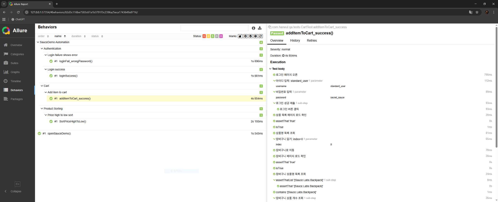

# SauceDemo Automation (Selenium / Java)

## Overview
This project is a Selenium-based UI automation test suite for the SauceDemo website.  
It focuses on core e-commerce flows and follows a maintainable Page Object Model structure.

- Language: Java
- Test Framework: JUnit 5
- Automation Tool: Selenium WebDriver
- Design Pattern: Page Object Model (POM)
- Reporting: Allure

## Test Scenarios
- Login (success / failure)
- Product sorting (price: high → low)
- Add product to cart
- Smoke test for core flows

## Project Structure

```
src/test/java
├─ core : WebDriver setup and lifecycle management
├─ pages : Page Object classes
├─ tests : Test scenarios
└─ utils : Common utilities (waits, parsers)
```

## Test Result (Allure Report)
Below is a screenshot of the Allure test report generated from this project.



## Notes
- Test execution targets the SauceDemo demo site.
- Allure results are not committed; only the report screenshot is included for visibility.
